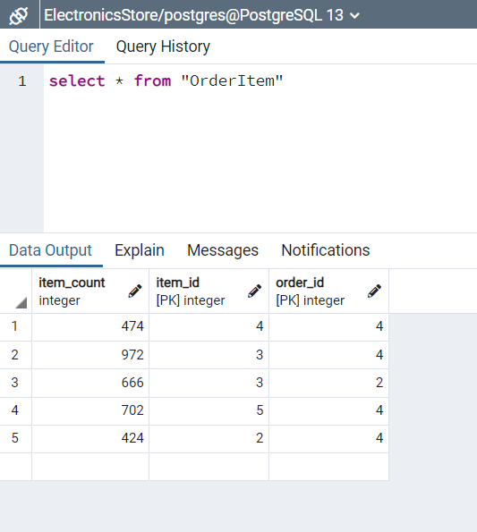

# Лабораторна робота 1 - Проектування бази даних та ознайомлення з базовими операціями СУБД PostgreSQL
# Гончаров Влас, КВ-83
## База даних **Магазин електроніки**
База даних складається з 6 таблиць (4 сутностей, 2 таблиць-зв'язків)

## Таблиця опису бази даних
| Відношення | Атрибут                                             | Тип                         |
|------------|-----------------------------------------------------|-----------------------------|
| Item       | item_id - унікальний номер товару                   | SERIAL                      |
|            | price - ціна товару                                 | numeric(8,2)                |
|            | category - категорія товару                         | character varying(40)       |
| Store      | store_id - унікальний номер магазину                | SERIAL                      |
|            | city - місто                                        | character varying(40)       |
|            | street - вулиця                                     | character varying(50)       |
|            | building - будівля                                  | character varying(10)       |
| Seller     | seller_id - унікальний номер продавця               | SERIAL                      |
|            | store_id - номер магазину, в якому працює продавець | integer                     |
|            | name - ім'я продавця                                | character varying(60)       |
|            | works_from_timestamp - дата прийому на роботу       | timestamp without time zone |
| Order      | order_id - унікальний номер замовлення              | SERIAL                      |
|            | status - статус замовлення                          | boolean                     |
|            | seller_id - продавець замовлення                    | integer                     |
|            | "timestamp" - час замовлення                        | timestamp without time zone |
| OrderItem  | item_count - кількість товарів                      | integer                     |
|            | item_id - номер товару                              | integer NOT NULL            |
|            | order_id - номер замовлення                         | integer NOT NULL            |
| Rel        | amount - кількість товару                           | integer                     |
|            | item_id - номер товару                              | integer NOT NULL            |
|            | store_id - номер магазину                           | integer NOT NULL            |

## UML-діаграма


## Вміст таблиці **Item**


## Вміст таблиці **Store**


## Вміст таблиці **Seller**


## Вміст таблиці **Order**


## Вміст таблиці **OrderItem**


## Вміст таблиці **Rel**


## Код SQL
## "Item" table 
Info about electronic devices
```
CREATE TABLE public."Item"
(
    item_id SERIAL,
    price numeric(8,2),
    category character varying(40) COLLATE pg_catalog."default",
    CONSTRAINT "Item_pkey" PRIMARY KEY (item_id)
)
WITH (
    OIDS = FALSE
)
TABLESPACE pg_default;
ALTER TABLE public."Item"
    OWNER to postgres;
```

## "Store" table
Stores location info
```
CREATE TABLE public."Store"
(
    store_id SERIAL,
    city character varying(40) COLLATE pg_catalog."default",
    street character varying(50) COLLATE pg_catalog."default",
    building character varying(10) COLLATE pg_catalog."default",
    CONSTRAINT "Store_pkey" PRIMARY KEY (store_id)
)
WITH (
    OIDS = FALSE
)
TABLESPACE pg_default;
ALTER TABLE public."Store"
    OWNER to postgres;
```

## "Seller" table
Basic info about sellers
```
CREATE TABLE public."Seller"
(
    seller_id SERIAL,
    store_id integer,
    name character varying(60) COLLATE pg_catalog."default",
    works_from_timestamp timestamp without time zone,
    CONSTRAINT "Seller_pkey" PRIMARY KEY (seller_id),
    CONSTRAINT "FK_StoreSeller" FOREIGN KEY (store_id)
        REFERENCES public."Store" (store_id) MATCH SIMPLE
        ON UPDATE NO ACTION
        ON DELETE CASCADE
        NOT VALID
)
WITH (
    OIDS = FALSE
)
TABLESPACE pg_default;
ALTER TABLE public."Seller"
    OWNER to postgres;
```

## "Order" table
Info about transactions
```
CREATE TABLE public."Order"
(
    order_id SERIAL,
    status boolean,
    seller_id integer,
    "timestamp" timestamp without time zone,
    CONSTRAINT "Order_pkey" PRIMARY KEY (order_id),
    CONSTRAINT "FK_SellerOrder" FOREIGN KEY (seller_id)
        REFERENCES public."Seller" (seller_id) MATCH SIMPLE
        ON UPDATE NO ACTION
        ON DELETE CASCADE
        NOT VALID
)
WITH (
    OIDS = FALSE
)
TABLESPACE pg_default;
ALTER TABLE public."Order"
    OWNER to postgres;
```

## "OrderItem" table
Links __"Item"__ and __"Order"__
```
CREATE TABLE public."OrderItem"
(
    item_count integer,
    item_id integer NOT NULL,
    order_id integer NOT NULL,
    CONSTRAINT "OrderItem_pkey" PRIMARY KEY (item_id, order_id),
    CONSTRAINT "FK_ItemOrderItem" FOREIGN KEY (item_id)
        REFERENCES public."Item" (item_id) MATCH SIMPLE
        ON UPDATE NO ACTION
        ON DELETE CASCADE
        NOT VALID,
    CONSTRAINT "FK_OrderOrderItem" FOREIGN KEY (order_id)
        REFERENCES public."Order" (order_id) MATCH SIMPLE
        ON UPDATE NO ACTION
        ON DELETE CASCADE
        NOT VALID
)
WITH (
    OIDS = FALSE
)
TABLESPACE pg_default;

ALTER TABLE public."OrderItem"
    OWNER to postgres;
```

## "Rel" table
Links __"Item"__ and __"Store"__
```
CREATE TABLE public."Rel"
(
    amount integer,
    item_id integer NOT NULL,
    store_id integer NOT NULL,
    CONSTRAINT "Rel_pkey" PRIMARY KEY (item_id, store_id),
    CONSTRAINT "FK_ItemRel" FOREIGN KEY (item_id)
        REFERENCES public."Item" (item_id) MATCH SIMPLE
        ON UPDATE NO ACTION
        ON DELETE CASCADE
        NOT VALID,
    CONSTRAINT "FK_StoreRel" FOREIGN KEY (store_id)
        REFERENCES public."Store" (store_id) MATCH SIMPLE
        ON UPDATE NO ACTION
        ON DELETE CASCADE
        NOT VALID
)
WITH (
    OIDS = FALSE
)
TABLESPACE pg_default;

ALTER TABLE public."Rel"
    OWNER to postgres;
```
