# Лабораторна робота 2 - Створення додатку бази даних, орієнтованого на взаємодію з СУБД PostgreSQL
# Гончаров Влас, КВ-83

## Меню вибору таблиці 
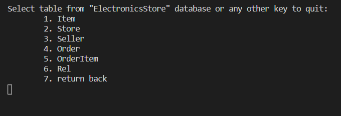

## Меню вибору дії над таблицею
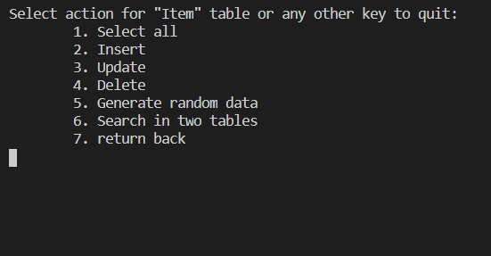

## Вивід вмісту таблиці
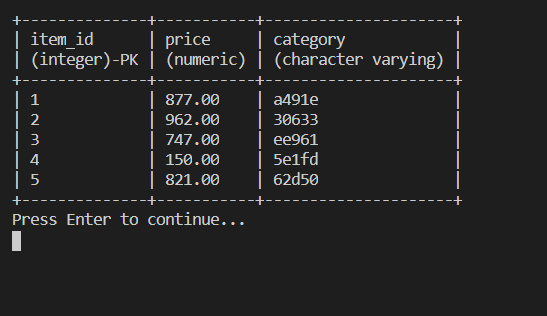

## Вставка нового рядка
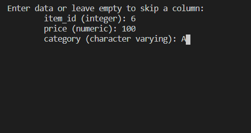
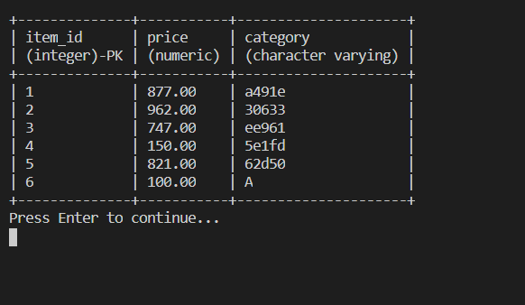

## Оновлення існуючого рядка
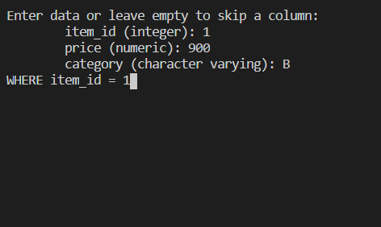
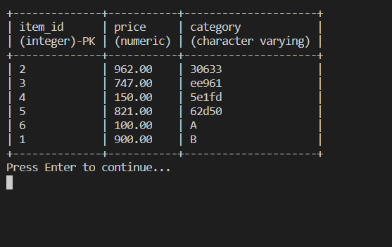

## Генерування рандомізованих даних
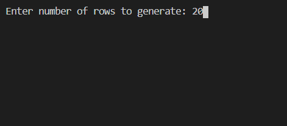
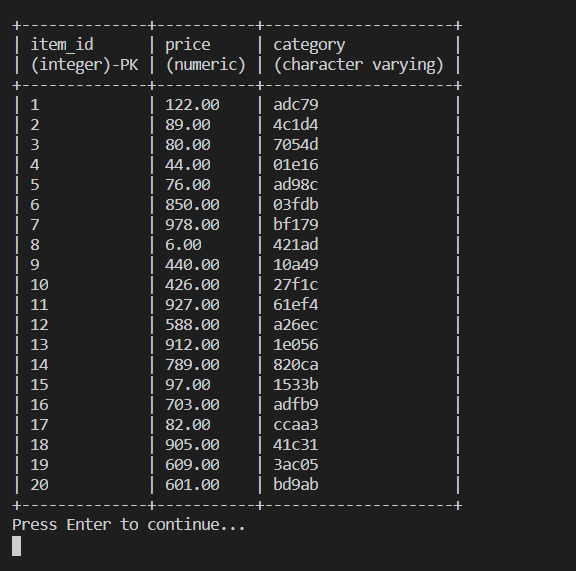

## Видалення за умовою
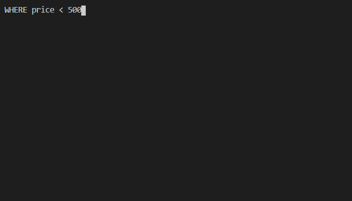
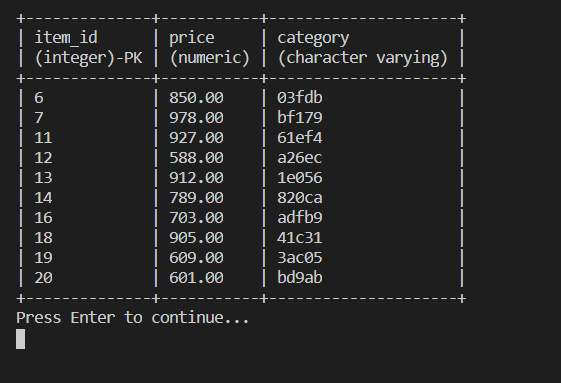

## Пошук в двох таблицях за умовами
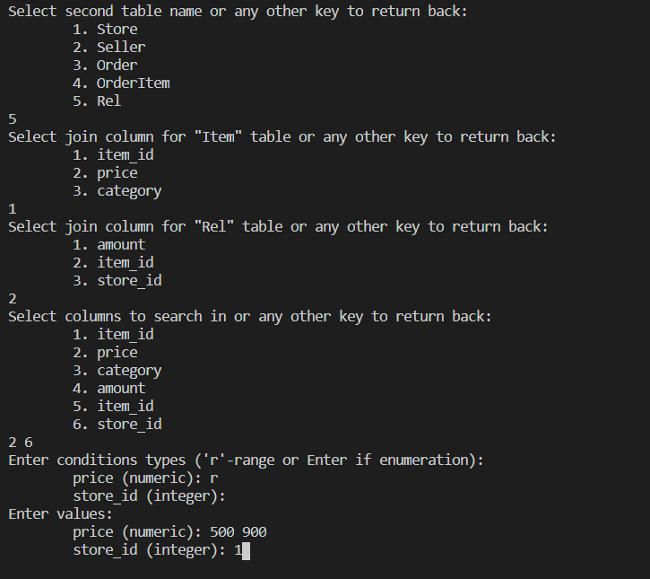
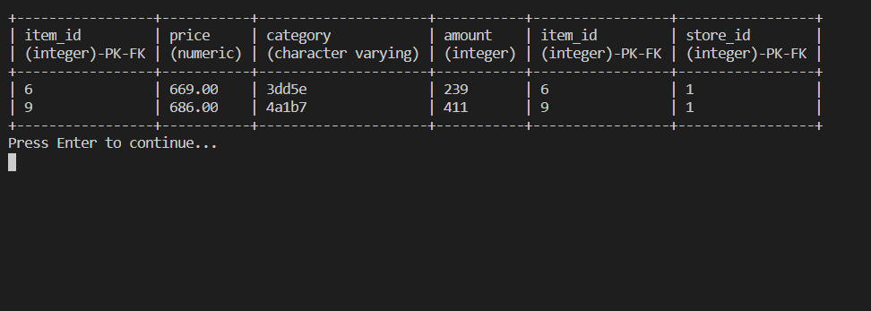
